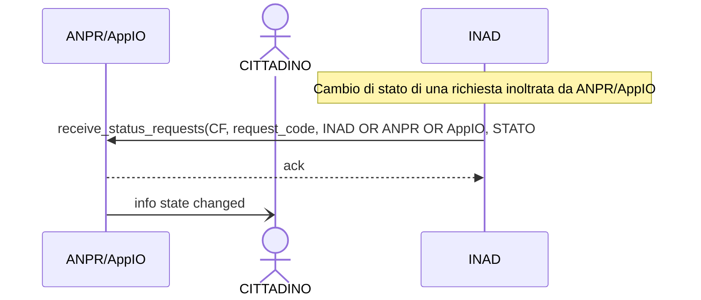

**UC007 - notifica cambio di stato del CITTADINO**

```mermaid
 sequenceDiagram
  participant A as ANPR/AppIO
  actor C as CITTADINO
  participant I as INAD

  Note over I: Cambio di stato di una richiesta inoltrata da ANPR/AppIO

  I ->> A: receive_status_requests(CF, request_code, INAD OR ANPR OR AppIO, STATO
  A -->> I: ack
  A -) C: info state changed

```

[torna a readme.md](../readme.md)
