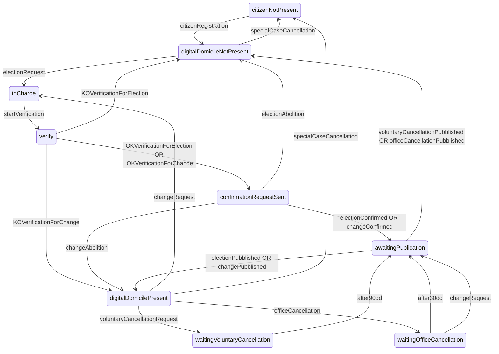

# Integrazione INAD con ANPR e AppIO

## Acronimi e termini

- **CITTADINO**:
   le persone fisiche che abbiano compiuto il diciottesimo anno di età e che abbiano la capacità di agire
- **domicilio digitale**:
   PEC, prevista inclusione dei sistemi di notifica certificati ai sensi del eIDASR

- **eIDASR**:
  [regolamento (ue) n. 910/2014 del parlamento europeo e del consiglio][1]
- **LG INAD**:
  [LINEE GUIDA dell’Indice nazionale dei domicili digitali delle persone fisiche, dei
professionisti e degli altri enti di diritto privato non tenuti all’iscrizione in albi, elenchi o registri professionali o nel registro delle imprese][2], allo stato le LG adottate da AgID in attuazione dell’[articolo 6-quater del CAD nella versione antecedente allo 06/11/2022][3], è prevista la revisione delle LG per adeguarle all'ultima versione del citato articolo del CAD
- **CAD**:
  [decreto legislativo 7 marzo 2005, n. 82][4]
- **LG Interoperabilità**:
  [Linee Guida sull’interoperabilità tecnica delle Pubbliche Amministrazioni][5]
- **LG PDND**:
  [Linee Guida sull’infrastruttura tecnologica della Piattaforma Digitale Nazionale Dati per l’interoperabilità dei sistemi informativi e delle basi di dati][6]

[1]: https://eur-lex.europa.eu/legal-content/IT/TXT/HTML/?uri=CELEX%3A32014R0910&from=EN

[2]: https://trasparenza.agid.gov.it/moduli/downloadFile.php?file=oggetto_allegati/212581610420O__OLinee+guida+INAD+art.+6-quater+CAD.pdf

[3]: https://www.normattiva.it/uri-res/N2Ls?urn:nir:stato:decreto.legislativo:2005-03-07;82~art6quater!vig=2021-11-06

[4]: https://www.normattiva.it/uri-res/N2Ls?urn:nir:stato:decreto.legislativo:2005-03-07;82!vig=2022-02-18

[5]: https://www.agid.gov.it/sites/default/files/repository_files/linee_guida_interoperabilit_tecnica_pa.pdf

[6]: https://www.agid.gov.it/sites/default/files/repository_files/lg_infrastruttura_interoperabilita_pdnd.pdf

## Requirement

### Functional Requirement

>  ***FR.001***
>> **name:**
>> tipi domicili digitali
>
>> **description:**
>>
>> - PEC, type mailbox conforme a rfc5321
>
>> **for:**
>> INAD

>  ***FR.002***
>> **name:**
>> soggetti che posso eleggere domicilio digitale
>
>> **description:**
>>
>> - (CITTADINI) persone fisiche che abbiano compiuto il diciottesimo anno di età e che abbiano la capacità di agire
>> - (PROFESSIONISTI) professionisti ai sensi della legge n. 4/2013
>> - (ENTI) enti di diritto privato non tenuti all’iscrizione nell’INI-PEC"
>
>> **for:**
>> INAD

>  ***FR.003***
>> **name:**
>> dati registrazione CITTADINI
>
>> **description:**
>>
>> - nome, ottenuti dall'autenticazione 
>> - cognome, ottenuti dall'autenticazione 
>> - codice fiscale, ottenuti dall'autenticazione 
>> - email contatto, dichiarati
>
>> **for:**
>> INAD, ANPR, AppIO

>  ***FR.004***
>> **name:**
>> dati registrazione PROFESSIONISTI
>
>> **description:**
>>
>> - nome, ottenuti dall'autenticazione 
>> - cognome, ottenuti dall'autenticazione 
>> - codice fiscale, ottenuti dall'autenticazione 
>> - email contatto, dichiarati
>> - professione 4/2013, dichiarati
>> 
>> *CHECK*:
>> - professione 4/2013 <> professioni INI-PEC"
>
>> **for:**
>> INAD

>  ***FR.005***
>> **name:**
>> dati registrazione ENTI
>
>> **description:**
>>
>> registrazione fatta dal rappresentate legale:
>> - nome rappresentate legale, ottenuti dall'autenticazione
>> - cognome rappresentate legale, ottenuti dall'autenticazione
>> - codice fiscale rappresentate legale, ottenuti dall'autenticazione
>> - email contatto, dichiarati
>> - denominazione, dichiarati
>> - codice fiscale, dichiarati
>> - dichiarazione sostitutiva qualifica rappresentate legale, dichiarati
>> 
>> registrazione delegato del rappresentate legale:
>> - nome delegato rappresentate legale, ottenuti dall'autenticazione
>> - cognome delegato rappresentate legale, ottenuti dall'autenticazione
>> - codice delegato fiscale rappresentate legale, ottenuti dall'autenticazione
>> - nome rappresentate legale, dichiarati
>> - cognome rappresentate legale, dichiarati
>> - codice fiscale rappresentate legale, dichiarati
>> - email contatto, dichiarati
>> - denominazione, dichiarati
>> - codice fiscale, dichiarati 
>> - dichiarazione sostitutiva delega e qualifica rappresentate legale, dichiarati
>> 
>> *CHECK:*
>> - codice fiscale ENTE, with AT
>> - ENTE not in INI-PEC
>> - ENTE not in IPA"
>
>> **for:**
>> INAD

>  ***FR.006***
>> **name:**
>> azioni ciclo di vita domicilio digitale
>
>> **description:**
>>
>> - elezione
>> - modifica
>> - cessazione volontaria (not for CITTADINO=Professionista INI-PEC)
>> - cessazione d'ufficio (domicilio digitale non funzionante)
>> - cessazione in casi particolari (decesso CITTADINO or PROFESSIONISTA, estinzione ENTE)"
>
>> **for:**
>> INAD, ANPR, AppIO

>  ***FR.007***
>> **name:**
>> fasi richiesta elezione, modifica, cessazione volontaria ciclo di vita domicilio digitale
>
>> **description:**
>>
>> - richiesta:
>>   - autenticazione
>>   - raccolta_dati
>>   - validazione (*CHECK* disponibilità del domicilio digitale per il CITTADINO e funzionamento domicilio digitale per elezione e modifica)
>> - pubblicazione (entro le 1.00 del giorno successivo alla richiesta per elezione/modica/cessazione d'ufficio/cessazione per casi paticolari, entro le 1.00 dopo 90gg dalla richiesta per cessazione volontaria)"
>
>> **for:**
>> INAD, ANPR, AppIO

>  ***FR.008***
>> **name:**
>> stati richiesta CITTADINO in INAD
>
>> **description:**
>>
>> un CITTADINO in INAD può trovarsi nei seguenti stati:
>> - citizenNotPresent, il CITTADINO non risulta registrato in INAD
>> - digitalDomicileNotPresent, il CITTADINO è registrato in INAD ma il domicilio digitale non è stato eletto
>> - inCharge, il CITTADINO è registrato in INAD e risulta l'avvio di una richiesta
>> - verify, il CITTADINO è registrato con una richiesta in verifica
>> - confirmationRequestSent, il CITTADINO è registrato in INAD ed è stata mandata conferma della richiesta alla PEC o email di contatto del CITTADINO
>> - awaitingPublication, il CITTADINO è registrato con una richiesta in attesa di pubblicazione
>> - digitalDomicilePresent, il CITTADINO è registrato e il domicilio digitale è stato eletto
>
>> **for:**
>> INAD, ANPR, AppIO

>  ***FR.009***
>> **name:**
>> annullamento richieste
>
>> **description:**
>>
>> il CITTADINO puo' annullare le richiesta prima dell'avvio della verifica 
>
>> **for:**
>> INAD, ANPR, AppIO

>  ***FR.010***
>> **name:**
>> una solo richiesta 
>
>> **description:**
>>
>> per ogni CITTADINO è possibile sottomettere una sola richiesta di azione (elezione, modifica, cancellazione volontaria) per volta in INAD
>
>> **for:**
>> INAD, ANPR, AppIO

>  ***FR.011***
>> **name:**
>> notifica variazioni intervenute da INAD a ANPR/AppIO
>
>> **description:**
>>
>> alla conclusione della pubblicazione (entro ore 1.00 di ogni giorno) INAD inoltra le variazioni intervenute (insert, modify, deleted) sui domicili digitali dei solo CITTADINI a ANPR e AppIO
>
>> **for:**
>> INAD, ANPR, AppIO

>  ***FR.012***
>> **name:**
>> recupero snapshot domicili digitali eletti
>
>> **description:**
>>
>> INAD rende disponibile lo snapshot dei domicili digitali eletti dai CITTADINI ad ANPR
>
>> **for:**
>> INAD, ANPR, AppIO

>  ***FR.013***
>> **name:**
>> inoltro richiesta elezione, modifica, cessazione volontaria x PEC
>
>> **description:**
>> 
>> ANPR e AppIO inoltrano richiesta di elezione, modifica, cessazione volontaria di un CITTADINO
>> 
>> ANPR/AppIO sono responsabile della richiesta.autenticazione e richiesta.raccolta_dati
>>
>> INAD è responsabile della richiesta.validazione e pubblicazione
>
>> **for:**
>> INAD, ANPR, AppIO

>  ***FR.014***
>> **name:**
>> inoltro confema/annullamento richiesta
>
>> **description:**
>> 
>> INAD notifica ad ANPR/AppIO l'avvenuta conferma o annullamento della richiesta di elezione, modifica e cancellazione volontaria di un CITTADINO
>
>> **for:**
>> INAD, ANPR, AppIO

>  ***FR.015***
>> **name:**
>> inoltro esito verifica
>
>> **description:**
>> 
>> INAD notifica ad ANPR/AppIO  l'avvenuta conferma o annullamento della richiesta
>
>> **for:**
>> INAD, ANPR, AppIO

>  ***FR.018***
>> **name:**
>> recupero email contatto CITTADINO
>
>> **description:**
>> 
>> INAD rende disponibile il recupero dell'email contatto di un CITTADINO
>
>> **for:**
>> INAD, ANPR, AppIO

>  ***FR.019***
>> **name:**
>> inoltro modifica email contatto
>
>> **description:**
>>
>> ANPR/AppIO inoltrano il cambio della email contatto
>
>> **for:**
>> INAD, ANPR, AppIO

>  ***FR.020***
>> **name:**
>> inoltro decesso CITTADINO
>
>> **description:**
>> 
>> ANPR inoltra l'evendo di decesso di un CITTADINO ad INAD
>
>> **for:**
>> INAD, ANPR

### Non Functional Requirement

>  ***NFR.001***
>> **name:**
>> tecnologia servizi
>
>> **description:**
>>
>> i servizi realizzati da INAD, ANPR e AppIO sono implementati tramite API REST e descritti da OpenAPI 3.0 nel rispetto delle LG Interoperabilità
>
>> **for:**
>> INAD, ANPR, AppIO

>  ***NFR.002***
>> **name:**
>> autenticazione client
>
>> **description:**
>>
>> l'autenticazione dei client ai servizi di INAD, ANPR e AppIO è realizzatra tramite PDND nel rispetto delle LG PDND
>
>> **for:**
>> INAD, ANPR, AppIO

>  ***NFR.003***
>> **name:**
>> non ripudio delle richieste
>
>> **description:**
>> le request dei client sono firmate attuando il patter sicurezza INTEGRITY_REST_01 delle LG Interoperabilità 
>
>> **for:**
>> INAD, ANPR, AppIO

>  ***NFR.004***
>> **name:**
>> non ripudio delle risposte
>
>> **description:**
>> le response dei servizi sono firmate attuando il patter sicurezza INTEGRITY_REST_01 delle LG Interoperabilità 
>
>> **for:**
>> INAD, ANPR, AppIO

## Use Case

### UC001 - notifica richiesta elezione domicilio digitale di un CITTADINO
**Il presente use case è di interesse per ANPR e AppIO.**

Si assume che ANPR/AppIO abbia dato seguito all'autenticazione del CITTADINO, nel rispetto dell'art. 64 del CAD, e recuperato per lo stesso i seguenti attributi:
- nome, ottenuti dall'autenticazione 
- cognome, ottenuti dall'autenticazione 
- codice fiscale, ottenuti dall'autenticazione. 

Il presente Use Case prevede:

1. ANPR/AppIO richiede ad INAD lo stato del CITTADINO utilizzando la API status_check inoltrando il codice fiscale

*se lo STATE del CITTADINO è citizenNotPresent allora:*

2. ANPR/AppIO presenta informativa INAD per registrazione al CITTADINO e gli richiede: 

  - email di contatto
  - PEC da eleggere come domicilio digitale

3. ANPR/AppIO notifica ad INAD la richiesta utilizzando la API request_action inoltrando codice fiscale, nome, cognome, email di contatto e PEC ed ottenendo come risposta il request_code assegnato da INAD e il nuovo stato del CITTADINO uguale a inCharge

4. ANPR/AppIO informa il CITTADINO della circostanza

*se lo STATE del CITTADINO è digitalDomicileNotPresent allora:*

2. ANPR/AppIO richiede al CITTADINO: 

  - PEC da eleggere come domicilio digitale

3. ANPR/AppIO notifica ad INAD la richiesta utilizzando la API request_action inoltrando codice fiscale e PEC ed ottenendo come risposta il request_code assegnato da INAD e il nuovo stato del CITTADINO uguale a inCharge 

4. ANPR/AppIO informa il CITTADINO della circostanza

*altrimenti:*

2. ANPR/AppIO informa il CITTADINO della circostanza

Il [sequence-diagram](mermind/UC001.md) sintetizza il presente Use Case.

### UC002 - notifica richiesta modifica domicilio digitaledi un CITTADINO
**Il presente use case è di interesse per ANPR e AppIO.**

Si assume che ANPR/AppIO abbia dato seguito all'autenticazione del CITTADINO, nel rispetto dell'art. 64 del CAD, e recuperato per lo stesso i seguenti attributi:
- nome, ottenuti dall'autenticazione 
- cognome, ottenuti dall'autenticazione 
- codice fiscale, ottenuti dall'autenticazione. 

Il presente Use Case prevede:

1. ANPR/AppIO richiede ad INAD lo stato del CITTADINO utilizzando la API status_check inoltrando il codice fiscale

*se lo STATE del CITTADINO è digitalDomicilePresent OR waitingOfficeCancellation allora:*

2. ANPR/AppIO richiede al CITTADINO: 

  - PEC da eleggere come domicilio digitale

3. ANPR/AppIO notifica ad INAD la richiesta utilizzando la API request_action inoltrando codice fiscale e PEC ed ottenendo come risposta il request_code assegnato da INAD e il nuovo stato del CITTADINO uguale a inCharge

4. ANPR/AppIO informa il CITTADINO della circostanza

*altrimenti:*

2. ANPR/AppIO informa il CITTADINO della circostanza

Il [sequence-diagram](mermind/UC002.md) sintetizza il presente Use Case.

### UC004 - notifica richiesta cessazione volontaria domicilio digitale di un CITTADINO
**Il presente use case è di interesse per ANPR e AppIO.**

Si assume che ANPR/AppIO abbia dato seguito all'autenticazione del CITTADINO, nel rispetto dell'art. 64 del CAD, e recuperato per lo stesso i seguenti attributi:
- nome, ottenuti dall'autenticazione 
- cognome, ottenuti dall'autenticazione 
- codice fiscale, ottenuti dall'autenticazione. 

Il presente Use Case prevede:

1. ANPR/AppIO richiede ad INAD lo stato del CITTADINO utilizzando la API status_check inoltrando il codice fiscale

*se lo STATO del CITTADINO è digitalDomicilePresent allora:*

2. ANPR/AppIO richiede al CITTADINO la volontà di cessare il proprio domicilio infomando che l'effetto della stessa richiesta avverrà dopo 90gg

3. ANPR/AppIO notifica ad INAD la richiesta utilizzando la API request_action inoltrando codice fiscale ed ottenendo come risposta il request_code assegnato da INAD e il nuovo stato del CITTADINO uguale a inCharge

4. ANPR/AppIO informa il CITTADINO della circostanza

*altrimenti:*

2. ANPR/AppIO informa il CITTADINO della circostanza

Il [sequence-diagram](mermind/UC004.md) sintetizza il presente Use Case.

### UC007 - notifica cambio di stato del CITTADINO
**Il presente use case è di interesse per ANPR e AppIO.**

Si assume che sia avvenuto un cambio di stato di un CITTADINO in INAD.

Il seguente state diagram descrive le variazioni di stato gestiti da INAD.

1. INAD notifica a ANPR/AppIO il cambio di stato utilizzando la API receive_status_change inoltrando il codice fiscale del CITTADINO interessato, request_code assegnato da INAD, il riferimento a INAD, ANPR o AppIO, il nuovo stato del CITTADINO (vedi vertices dello state diagram precedente) e la motivazione che ha determinato il cambio di stato (vedi edges dello state diagram precedente)

2. ANPR/AppIO informa il CITTADINO della circostanza

N.b. INAD non notifica gli effetti della pubblicazione (awaitingPublication - electionPubblished OR changePubblished -> digitalDomicilePresent e awaitingPublication - voluntaryCancellationPubblished OR officeCancellation -> digitalDomicileNotPresent) in quanto gli le evidenze degli stessi sono ottenute da ANPR e AppIO dall'applicazione del UC0011.

Il [sequence-diagram](mermind/UC007.md) sintetizza il presente Use Case.

### UC008 - inoltro aggiornamento email di contatto
**Il presente use case è di interesse per ANPR e AppIO.**

Si assume che ANPR/AppIO abbia dato seguito all'autenticazione del CITTADINO, nel rispetto dell'art. 64 del CAD, e recuperato per lo stesso i seguenti attributi:
- nome, ottenuti dall'autenticazione 
- cognome, ottenuti dall'autenticazione 
- codice fiscale, ottenuti dall'autenticazione. 

Il presente Use Case prevede:

1. ANPR/AppIO richiede ad INAD lo stato del CITTADINO utilizzando la API status_check inoltrando il codice fiscale

*se lo STATE del CITTADINO è citizenNotPresent allora:*

2. ANPR/AppIO informa il CITTADINO della circostanza

*altrimenti:*

2. ANPR/AppIO richiede al CITTADINO: 

  - email di contatto 

3. ANPR/AppIO notifica ad INAD la nuova email di contatto utilizzando la API changed_email inoltrando codice fiscale e email di contatto

4. ANPR/AppIO informa il CITTADINO della circostanza

Il [sequence-diagram](mermind/UC008.md) sintetizza il presente Use Case.

### UC009 - notifica variazione email di contatto
**Il presente use case è di interesse per ANPR e AppIO.**

Si assume che la email di contatto del CITTADINO sia stata modificata. 

Il presente Use Case prevede:

1. INAD notifica ad ANPR/AppIO la nuova email di contatto utilizzando la API changed_email inoltrando codice fiscale e email di contatto

2. ANPR/AppIO informa il CITTADINO della circostanza

N.b. INAD assicura la notifica ad ANPR/AppIO sse la richiesta di variazione della email di contatto del CITTADINO non è stata notifica dallo stesso e, per AppIO, se il CITTADINO ha esegueto almeno un'azione di elezione, modifica cancellazione volontaria tramite AppIO o recuperati dalla stessa AppIO su consenso del CITTADINO.

Il [sequence-diagram](mermind/UC009.md) sintetizza il presente Use Case.

### UC010 - notifica decesso
**Il presente use case è di interesse per ANPR.**

Si assume che il CITTADINO sia deceduto e in ANPR è presente il domicilio digitale dello stesso. 

Il presente Use Case prevede:

1. ANPR notifica ad INAD la il decesso del CITTADINO utilizzando la API death_notification inoltrando il codice fiscale 

Il [sequence-diagram](mermind/UC010.md) sintetizza il presente Use Case.

### UC011 - notifica variazioni dei domicili digitali pubblicati
**Il presente use case è di interesse per ANPR e AppIO.**

Si assume la conclusione del task di pubblicazione realizzato da INAD entro le ore 1.00 di ogni giorno

Il presente Use Case prevede:

1. INAD notifica ad ANPR/AppIO le variazioni dei domicili digitali pubblicati utilizzando la API receive_changed_digital_addresses inoltrando la data di riferimento e l'elenco dei domicili variati (insert, update, deleted)

N.b. INAD assicura inoltro anche in assenza di variazioni

*se la notifica ha buon esito*

2. INAD elimina l'elenco delle variazioni

*se la notifica non ha buon esito*

2. INAD conserva l'elenco delle variazioni relativamente all'attuale giorno

3. ANPR/AppIO recuperano l'elenco delle variazioni utilizzando la API recovers_changed_digital_addresses (dopo le 2.00 di ogni giorno) per il giorno di interesse

N.b. INAD assicura:

- l'inoltro ad AppIO dei soli domicili digitali per cui il CITTADINO ha esegueto almeno un'azione di elezione, modifica cancellazione volontaria tramite AppIO o recuperati dalla stessa AppIO su consenso del CITTADINO 

- la disponibilità dell'elenco delle variazioni per 5gg superato il quale ANPR/AppIO applicano UC012.

- la notifica di una insert o update del domicilio digitale di un CITTADINO comporta l'implicita variazione di stato a digitalDomicilePresent

- la notifica di una deleted del domicilio digitale di un CITTADINO comporta l'implicita variazione di stato a digitalDomicileNotPresent

Il [sequence-diagram](mermind/UC011.md) sintetizza il presente Use Case.

### UC012 - recupero elenco domicili digitali
**Il presente use case è di interesse per ANPR**

Si assume che ANPR abbia l'esigenza di effettuare il setting dei domicili digitali.

Il presente Use Case prevede:

1. ANPR recuperano l'elenco dei domicili digitali eletti utilizzando la API sync_digital_addresses ottenendo l'elenco dei domicili digitali

Il [sequence-diagram](mermind/UC012.md) sintetizza il presente Use Case.

### UC013 - recupero domicilio digitale di un cittadino
**Il presente use case è di interesse per AppIO.**

Si assume che AppIO abbia dato seguito all'autenticazione del CITTADINO, nel rispetto dell'art. 64 del CAD, e recuperato per lo stesso i seguenti attributi:
- nome, ottenuti dall'autenticazione 
- cognome, ottenuti dall'autenticazione 
- codice fiscale, ottenuti dall'autenticazione. 

Il presente Use Case prevede:

1. AppIO richiede ad INAD lo stato del CITTADINO utilizzando la API status_check inoltrando il codice fiscale

*se lo STATE del CITTADINO è digitalDomicilePresent allora:*

2. AppIO richiede consenso del CITTADINO per recuperare il proprio domicilio digitale

3. AppIO recupera il domicilio digitale del cittadino utilizzando la API digital_address inoltrando il codice fiscale del cittadino

4. AppIO informa il CITTADINO della circostanza

*altrimenti:*

2. AppIO informa il CITTADINO della circostanza

Il [sequence-diagram](mermind/UC013.md) sintetizza il presente Use Case.

### UC014 - abbandono AppIO
**Il presente use case è di interesse per AppIO.**

Si assume che un cittadino abbia rinunciato all'utilizzo dell'AppIO. 

Il presente Use Case prevede:

1. AppIO richiede ad INAD lo stato del CITTADINO utilizzando la API status_check inoltrando il codice fiscale

*se lo STATE del CITTADINO è citizenNotPresent allora:*

2. AppIO informa il CITTADINO della circostanza

*altrimenti:*

2. AppIO notifica la rinuncia del CITTADINO utilizzando appIO_abandonment inoltrando il codice fiscale

Il [sequence-diagram](mermind/UC014.md) sintetizza il presente Use Case.

## Data Model
 > citizen_status
 >> string 
 >
 >> enum
 >>   - citizenNotPresent
 >>   - digitalDomicileNotPresent
 >>   - inCharge
 >>   - verify
 >>   - confirmationRequestSent
 >>   - awaitingPublication
 >>   - waitingVoluntaryCancellation
 >>   - waitingOfficeCancellation
 >>   - digitalDomicilePresent

 > citizen_change_status_reason
 >> string 
 >
 >> enum
 >>   - citizenRegistration
 >>   - electionRequest
 >>   - changeRequest
 >>   - voluntaryCancellationRequest
 >>   - startVerification
 >>   - OKVerificationForElection
 >>   - OKVerificationForChange
 >>   - KOVerificationForElection
 >>   - KOVerificationForChange
 >>   - electionConfirmed
 >>   - changeConfirmed
 >>   - after90dd
 >>   - electionAbolition
 >>   - changeAbolition
 >>   - electionPubblished
 >>   - changePubblished
 >>   - voluntaryCancellationPubblished
 >>   - officeCancellationPubblished
 >>   - officeCancellation
 >>   - after30dd
 >>   - specialCaseCancellation

 >  operation
 >>   string
 >
 >>   enum
 >>   - registration&insert
 >>   - insert
 >>   - update
 >>   - delete

  > codice_fiscale
  >>  string
  >
  >>  pattern = /^(?:[A-Z][AEIOU][AEIOUX]|[B-DF-HJ-NP-TV-Z]{2}[A-Z]){2}(?:[\dLMNP-V]{2}(?:[A-EHLMPR-T](?:[04LQ][1-9MNP-V]|[15MR][\dLMNP-V]|[26NS][0-8LMNP-U])|[DHPS][37PT][0L]|[ACELMRT][37PT][01LM]|[AC-EHLMPR-T][26NS][9V])|(?:[02468LNQSU][048LQU]|[13579MPRTV][26NS])B[26NS][9V])(?:[A-MZ][1-9MNP-V][\dLMNP-V]{2}|[A-M][0L](?:[1-9MNP-V][\dLMNP-V]|[0L][1-9MNP-V]))[A-Z]$/i

  > name
  >>  string

  > surname
  >>  string

  > email
  >>  string
  >
  >>  pattern = ^([a-zA-Z0-9_\-\.]+)@([a-zA-Z0-9_\-\.]+)\.([a-zA-Z]{2,5})$

  > email_contatto
  >>  email

  > digital_address
  >>  email

  > request_code
  >>  string
  >
  >>  pattern = (ANPR|APPIO)_<progressive>

  > list_changed_digital_address
  >>  object
  >>    - codice_fiscale
  >>    - digital_address
  >>    - action = (insert|update|delete)

  > list_digital_address
  >>  object
  >>    - codice_fiscale
  >>    - digital_address

## API REST

### API implementate da INAD

#### for ANPR
> required for UC001, UC002, UC004, UC008, UC013, UC014
>>citizen_status:status_check (codice_fiscale)

> required for UC001
>> citizen_status=inCharge, request_code :request_action(operation=registration&insert,name, surname, codice_fiscale, email_contatto, digital_address)

> required for UC001 
>> citizen_status=inCharge, request_code :request_action(operation=insert,codice_fiscale, digital_address)

> required for UC002 
>> citizen_status=inCharge, request_code :request_action(operation=update,codice_fiscale, digital_address)

> required for UC004 
>> citizen_status=inCharge, request_code :request_action(operation=delete,codice_fiscale)  

> required for UC008 
>> ack=changed_email(codice_fiscale,email_contatto)  

> required for UC010 
>> ack=death_notification(codice_fiscale)

> required for UC011 
>> list_changed_digital_address=recovers_changed_digital_addresses(day)

> required for UC012 
>> list_digital_address=sync_digital_addresses()

#### for APPIO
> required for UC001, UC002, UC004, UC008, UC013, UC014 
>> citizen_status:status_check (codice_fiscale)

> required for UC001 
>> citizen_status=inCharge, request_code :request_action(operation=registration&insert,name, surname, codice_fiscale, email_contatto, digital_address)

> required for UC001 
>> citizen_status=inCharge, request_code :request_action(operation=insert,codice_fiscale, digital_address)

> required for UC002
>> citizen_status=inCharge, request_code :request_action(operation=update,codice_fiscale, digital_address)

> required for UC004
>> citizen_status=inCharge, request_code :request_action(operation=delete,codice_fiscale)  

> required for UC008 
>> ack=changed_email(codice_fiscale,email_contatto)  

> required for UC011 
>> list_changed_digital_address=recovers_changed_digital_addresses(day)

> required for UC013 
>> digital_address=digital_address(codice_fiscale)

> required for UC014
>> ack=appIO_abandonment(codice_fiscale) 

### API implementate da AppIO/ANPR

> required for UC007 
>> ack=receive_status_change(codice_fiscale, request_code, citizen_status, citizen_change_status_reason)

> required for UC009
>> ack=receive_changed_email(codice_fiscale,email_contatto)

> required for UC011  
>> ack=receive_changed_digital_addresses(list_changed_digital_address)
